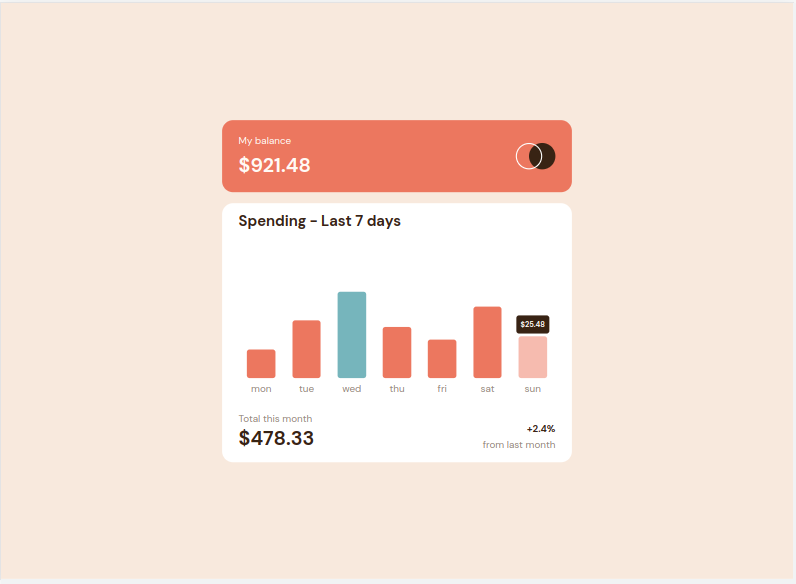

# Frontend Mentor - Expenses chart component solution

This is a solution to the [Expenses chart component challenge on Frontend Mentor](https://www.frontendmentor.io/challenges/expenses-chart-component-e7yJBUdjwt). Frontend Mentor challenges help you improve your coding skills by building realistic projects.

## Table of contents

-   [Overview](#overview)
    -   [The challenge](#the-challenge)
    -   [Screenshot](#screenshot)
    -   [Links](#links)
-   [My process](#my-process)

    -   [Built with](#built-with)
    -   [What I learned](#what-i-learned)
    -   [Continued development](#continued-development)

-   [Author](#author)

## Overview

### The challenge

Users should be able to:

-   View the bar chart and hover over the individual bars to see the correct amounts for each day
-   See the current day’s bar highlighted in a different colour to the other bars
-   View the optimal layout for the content depending on their device’s screen size
-   See hover states for all interactive elements on the page
-   **Bonus**: Use the JSON data file provided to dynamically size the bars on the chart

### Screenshot

### Links

-   Solution URL: [Add solution URL here](https://your-solution-url.com)

## My process

-   look at data model
-   sketch out UI and components model
-   build components with hard-coded holding text and basic CSS
-   build static version using data
-   identify items that need to be held in state and their common owner
-   initialise state items and functions to update them in common owner component and pass to child components as props
-   add function calls to child components to allow user inputs to update state
-   clean up CSS and make display responsive

### Built with

-   Semantic HTML5 markup
-   CSS custom properties
-   Flexbox
-   [React](https://reactjs.org/) - JS library

### What I learned

-   adding multiple conditional classes to an element
-   using a calculated number to style the size of an element in CSS
-   interpreting an ambiguous static image into a user interface that acts in expected ways
-   identifying constants and refactoring my code to calculating the same data repeatedly

### Continued development

-   creating React apps in Typescript, particularly how to pass function calls in props
-   pre-checking a json file to ensure that data is complete
-   setting up a React app without CRA

## Author

-   Frontend Mentor - [@lucywho](https://www.frontendmentor.io/profile/lucywho)
